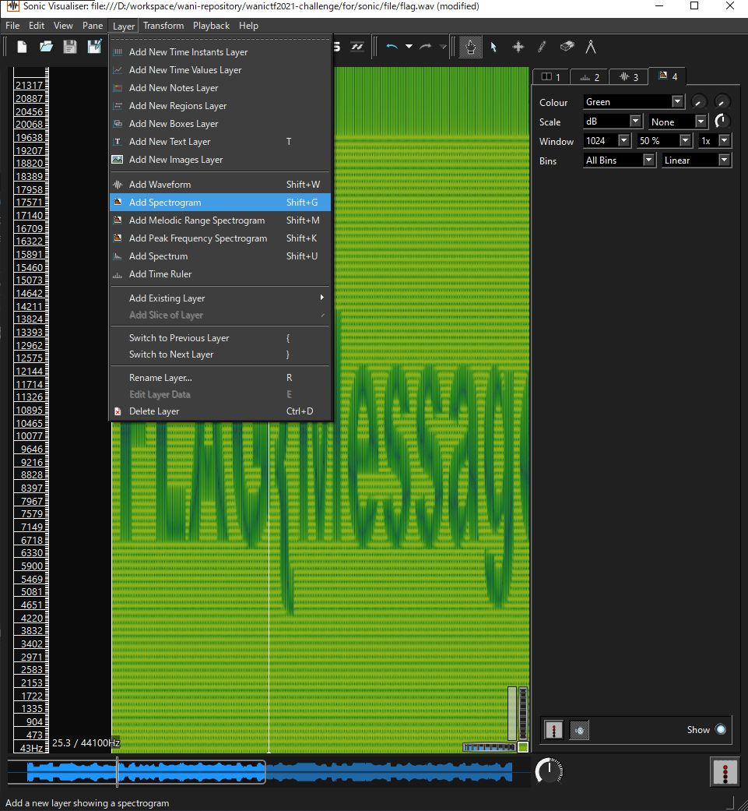

# sonic

## 問題文

妖怪からのメッセージです．

> 音量注意！

## 解法

[spectorology](https://github.com/solusipse/spectrology)という，画像を音に変換するツールを使って作った問題．
[Sonic Visualiser](https://www.sonicvisualiser.org/)などで配布ファイルをスペクトログラム形式で見ることで，FLAGが手に入る．

Sonic Visualiserの場合は以下の通り．

ちなみにspectorologyを使って普通の音楽ファイルに合成したりもできます．