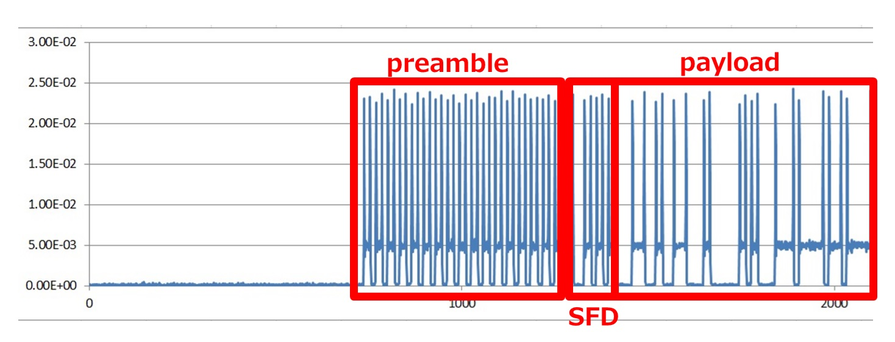
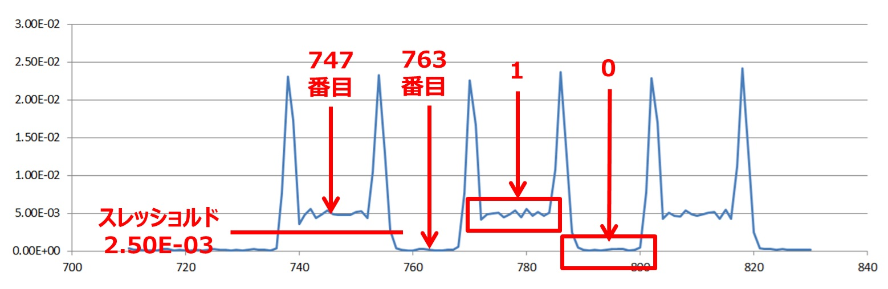

# ASK over the air
## 問題文

+ 無線通信問題3問目です。
+ ASK変調したデータを電波で飛ばしてUSRPでキャプチャしたデータです。
+ [フレームフォーマット](https://github.com/wani-hackase/memo-wireless-frame-format/blob/master/README.md)はdigital ASKと同じです。
+ I信号とQ信号に分かれているところが若干トリッキーですが、digital ASKが解けたなら行けるはず．．．
+ 実機使ったので謎のパルスノイズが乗っていますが、無視してください。

## 参考

+ [電波とＩＱ変調 : No Link No Life](http://nolinknolife.livedoor.blog/archives/19171967.html)


## 解法


ASKは振幅にデータが載っているのでI信号とQ信号をそれぞれ二乗して足したものの平方根を取ったものを以下のプログラムで出力してpower.csvとします。


```
import math

fp = open("./ask-over-the-air.csv", "r")

data = []
vals = fp.readline()
while True:
    vals = fp.readline()
    if vals == "":
        break

    vals = vals.split(",")
    val_i = float(vals[1])
    val_q = float(vals[2])
    print("%e" % math.sqrt(val_i * val_i + val_q * val_q))
```

power.csvの先頭をグラフ化するとプリアンブルっぽい規則的な信号がみえます。



プリアンブルの部分を使って、
1. スタートは何番目か？
2. 1と0のスレッショルドはいくつにしたらよいか？
3. 何シンボル毎にビット判定をすればよいか?

を決めて1/0を判定する以下のプログラムで処理してbits.csvとします。

今回はスタートが747、スレッショルドが2.50E-03、16シンボル毎に1/0判定を行います。




```
import math

fp = open("./power.csv", "r")

start = 746
interval = 16
threashold = 2.50E-03

i = 1
while True:
    if i == start:
        break

    val = fp.readline()
    if val == "":
        break
    val = float(val)
    i += 1

while True:
    val = fp.readline()
    if val == "":
        break
    val = float(val)
    if (i - start) % interval == 0:
        if val > threashold:
            print("1")
        else:
            print("0")
    i += 1
```


後はbits.csvを問題「binary」でデコードした方法でFLAGに変換します。


```
fp = open("./bits.csv", "r")

data = []
while True:
    val = fp.readline()
    if val == "":
        break

    data.append(int(val))

c = 0
for i in range(len(data)):
    c = (c << 1) | data[i]
    if i % 8 == 7:
        print(chr(c), end="")
        c = 0

print("")
```

## binary、ASK、ASK over the airを通して

ASK -> ASK over the airでIQ信号の説明をしっかりとするairを通していない問題を1つ2つ挟むべきだったなーと反省しています．．．
実はbpsk over the airとZigBeeというUSRPで電波をキャプチャしたデコード問題も作っていたのですが、いろいろあって直前で取りやめました。
今思うと、取りやめて本当に良かったなとホッとしています。(出したらたぶん炎上してた気がします。)
しかし最近大会にも全然出れてないし、CTFとの向き合い方とか関わっているプロジェクトとの付き合い方とかも少し考え直さなければならないな．．．
