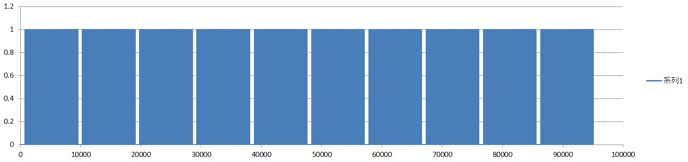
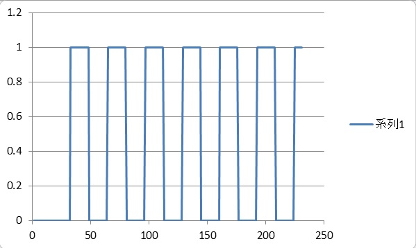

# ask
## 問題文

+ 無線通信問題2問目です。
+ WaniCTF 2021-springとほぼ同じ問題です。
+ この後の「ASK over the air」に関わるので以下の情報を意識して解いてみて下さい。
    + [無線通信のフレームフォーマット](https://github.com/wani-hackase/memo-wireless-frame-format/blob/master/README.md)
	+ preambleは10を16回繰り返した`0xAAAAAAAA`
	+ start frame delimiter (SFD)は`0xE5`
+ 実務では↑の情報もブラインドで解析することが多いです。


## 解法

### はじめに

ワイヤレスネットワーク問題2問目です。
まずは提供されているcsvをExcelで開いてグラフを書かせます。
するといくつかパケットが入ってるっぽいのがみえるので、1パケット分を切り出します。



そのあと、[無線通信のフレームフォーマット](https://github.com/wani-hackase/memo-wireless-frame-format/blob/master/README.md)でプリアンブルを見つけて10の繰り返しで1ビットが何シンボルで構成されているかを調べます。
770行目～1000行目の1フレーム目の先頭辺りをExcelでグラフ化すると以下のような図が得られます。
この部分がプリアンブルになっていて、10が繰り返し16回出てきているのが分かります。
このこの1の部分と0の部分が何シンボルで構成されているかを数えると16個であることが分かります。
つまり、16個の連続した1と0をそれぞれ1個の1と0に置き換えてbinaryのロジックに入れるとFLAGが取得できます。




1パケット分だけcsvから切り出してdigital_ask_solve.csvとして保存したものを次のプログラムに食わせればFLAGが出てきます。

```
fp = open("./digital_ask_solve.csv", "r")

data = []
# vals = fp.readline()
while True:
    vals = fp.readline()
    if vals == "":
        break

    vals = vals.split(",")
    data.append(int(vals[1]))

new_data = []
count = 0
current_value = 1
for i in range(len(data)):
    if current_value == data[i]:
        count += 1
    else:
        count = 1

    if count >= 16:
        new_data.append(current_value)
        count = 1

    current_value = data[i]


c = 0
for i in range(len(new_data)):
    c = (c << 1) | new_data[i]
    if i % 8 == 7:
        print(chr(c), end="")
        c = 0

print("")
```
