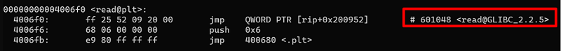

# got rewriter [pwn]
## 問題文

```
nc got-rewriter.pwn.wanictf.org 9003
```

### ヒント

+ 「参考になるwriteupを探す練習」用の問題です。
+ CTFではwriteupを探すと過去の問題で参考になる情報が載っているページがあったりすることが多く、それを読みながら少しずつ自分の技術力を高めていきます。
+ この問題では`got rewriter writeup WaniCTF`でググると参考になるページが出てくるかもしれません。

## 解法

Global Offset Table (通称GOT)を書き換えて解く問題です。
「got rewriter writeup WaniCTF」でwriteupを検索するとWaniCTF 2020で出題したときのwriteupがいろいろ出てくると思います
+ [got rewriter writeup WaniCTF - Google 検索](https://www.google.com/search?client=firefox-b-d&q=got+rewriter+writeup+WaniCTF)

参考までにWani Hackaseで公開しているwriteupは以下です。
+ [wanictf2020-writeup/pwn/04-got-rewriter at master · wani-hackase/wanictf2020-writeup · GitHub](https://github.com/wani-hackase/wanictf2020-writeup/tree/master/pwn/04-got-rewriter)

今回はread関数のGOTアドレス`0x601048`にwin関数のアドレス`0x400807`を書き込めばシェルが取れます。

Wani HackaseのwriteupではGOTアドレスの探し方について振れていなかったのでここで書いておくと、僕の場合はobjdumpを使って調べることが多いです。
今回の場合は、ダウンロードしたバイナリを使って
```
objdump -d -M intel ./got | less
```
とやるとディスアセンブルしたコードが出てきて、その中の`Disassembly of section .plt:`の下ら辺にGOTアドレスが出てきます。



writeupを見つけて解く系の問題なのでBOFが解ける人なら解けるかなーと思っていたのですが、思ったよりもBOFが解けていた人数から下がりました。
内部で「過去に出した問題を出すと炎上するかも」と心配していたのですが、writeup探す問はeasyとしてはちょうどよかったような気がします。
