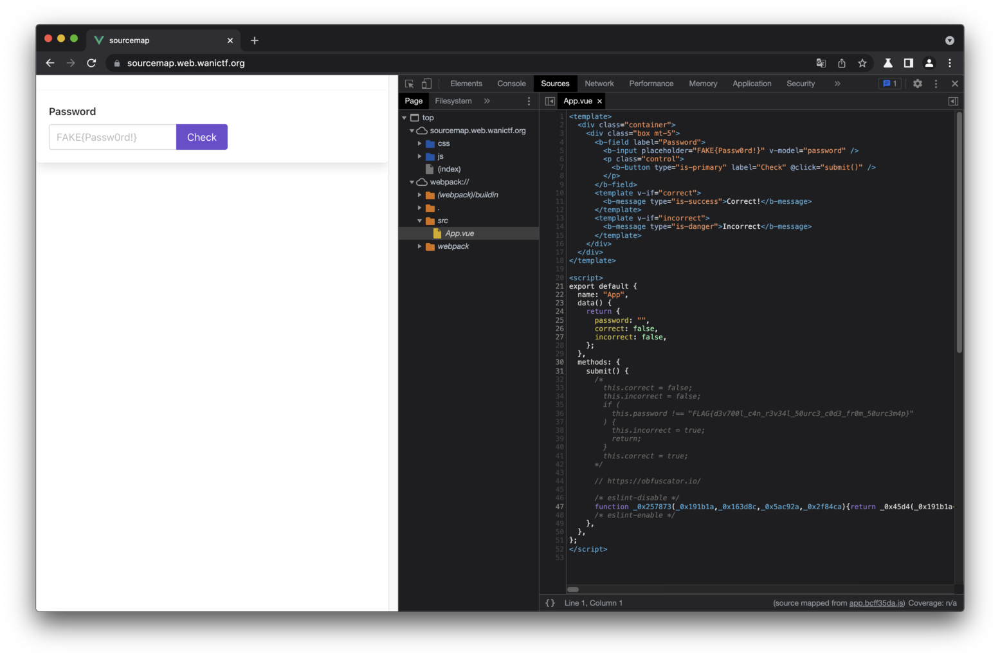

# sourcemap

## 問題文

へっへっへ...JavaScriptは難読化したから、誰もパスワードはわからないだろう...

え? ブラウザの開発者ツールのxxx機能から見れちゃうって!?

<https://sourcemap.web.wanictf.org>

## 解法

[ソースマップ - MDN](https://developer.mozilla.org/ja/docs/Tools/Debugger/How_to/Use_a_source_map)がこのWebアプリで配信されているため、開発者ツールの`Sources - Page - Top - webpack://`からソースマップを元に復元したJavaScriptコードが閲覧できます。



ここでは難読化前のコードを`src/App.vue`ファイルにコメントで書いていたのが残っているのでそこからフラグを取得できます。

```javascript
  methods: {
    submit() {
      /*
        this.correct = false;
        this.incorrect = false;
        if (
          this.password !== "FLAG{d3v700l_c4n_r3v34l_50urc3_c0d3_fr0m_50urc3m4p}"
        ) {
          this.incorrect = true;
          return;
        }
        this.correct = true;
      */
```

ソースマップはデバック時にはとても有用なものですが、外部へ公開するときに残っていると意図しないコメントが閲覧できてしまうことがあります。
